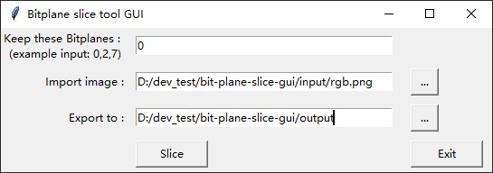

# bit-plane-slice-gui
A GUI tool to slice selected bitplanes off an image, then export it. Based on Python tk container.

### Background
[What is Bit plane ? (Wikipedia)](https://en.wikipedia.org/wiki/Bit_plane)

### Prerequests
1. Python
2. numpy & opencv-python

### Usage
Run `bit-plane-slice-gui.py`, on the prompt window:

1. Input bitplanes(0~7) you want to keep, in format like `0,3,4`. Unselected bitplane will be purged as 0
2. Select the image file to process
3. Select the export directory, exported file name is regulated as `original filename + bitplane number .jpg`

### Example
Extract bitplane[0] (the MSB of bitplanes) of the image `./input/rgb.png` :

Original image:

Bitplane[0]:

Bitplane[2] & [4] complex:

